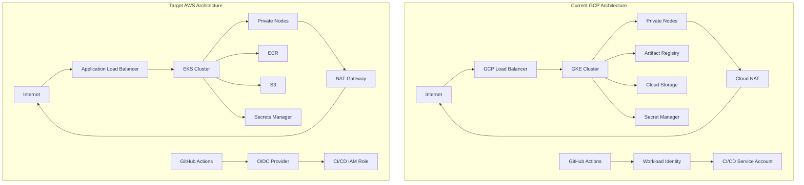
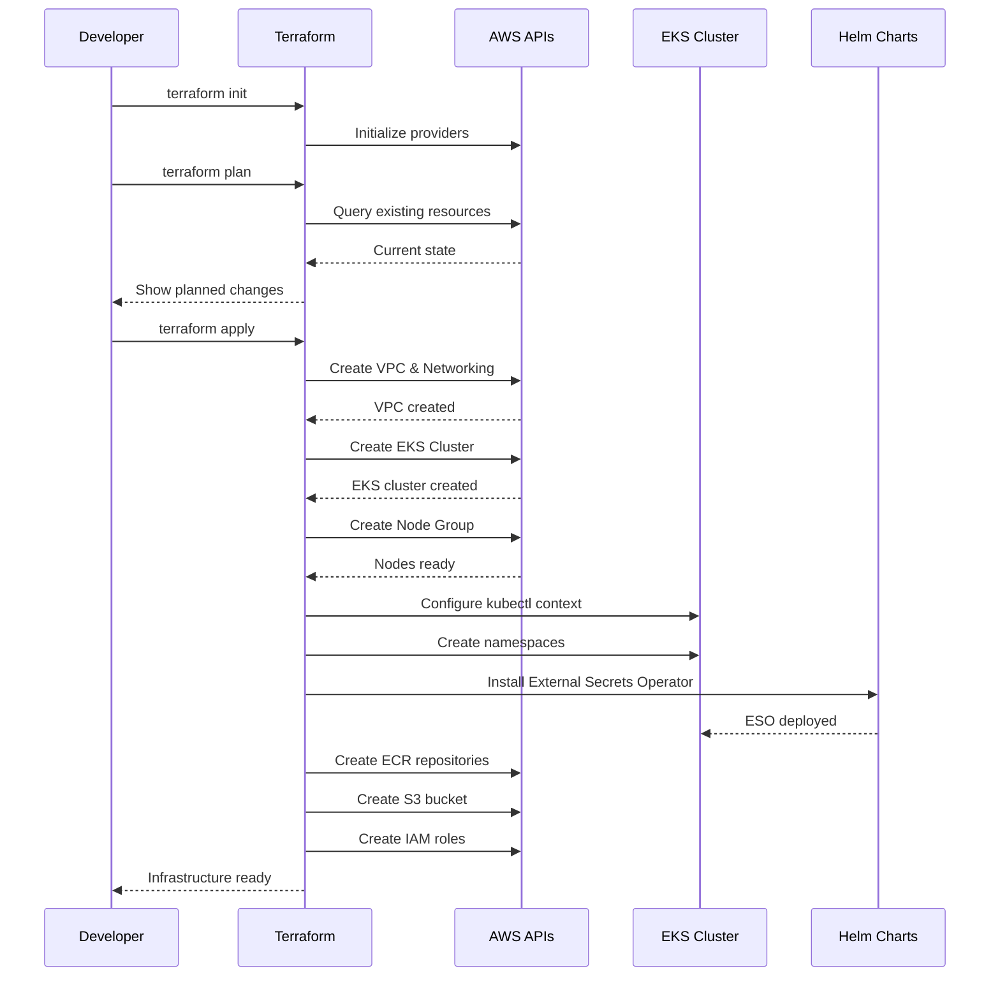

# Design Document: GCP to AWS Terraform Infrastructure Migration

## Overview

This design document outlines the comprehensive migration strategy for the Market Data Mining & Forecasting System (MDMFS) infrastructure from Google Cloud Platform (GCP) to Amazon Web Services (AWS). The migration maintains the existing microservices architecture with 8 services (Python FastAPI + Go), preserving all functionality while adapting to AWS-native services. The infrastructure will continue to support the local-first development workflow (Minikube → AWS EKS) and maintain the same security, scalability, and operational characteristics as the current GCP deployment.

The migration follows a module-by-module approach, creating equivalent AWS Terraform modules that mirror the existing GCP structure. This ensures a smooth transition with minimal disruption to development workflows and maintains infrastructure-as-code best practices.

## Architecture

### High-Level Architecture Comparison



### Service Mapping Table

| GCP Service | AWS Equivalent | Migration Notes |
|-------------|----------------|-----------------|
| GKE (Google Kubernetes Engine) | EKS (Elastic Kubernetes Service) | Similar managed Kubernetes, requires IRSA setup |
| Artifact Registry | ECR (Elastic Container Registry) | Per-repository model vs single registry |
| Cloud Storage | S3 | Similar object storage, versioning supported |
| Secret Manager | AWS Secrets Manager | Similar secret management, different IAM model |
| Workload Identity | IRSA (IAM Roles for Service Accounts) | Different implementation, same concept |
| Cloud NAT | NAT Gateway | Similar functionality, per-AZ deployment |
| Cloud Router | Route Tables | Implicit in VPC routing |
| VPC Network | VPC | Similar networking model |
| Workload Identity Federation | OIDC Identity Provider | GitHub Actions integration |
| Service Account | IAM Role | Different permission model |

## Main Workflow: Infrastructure Deployment



## Module Structure

The AWS Terraform infrastructure will mirror the GCP structure with equivalent modules:

```
terraform-aws/
├── main.tf                    # Root module orchestrating all submodules
├── variables.tf               # Input variables
├── outputs.tf                 # Output values for CI/CD
├── terraform.tfvars          # Variable values
└── modules/
    ├── networking/           # VPC, subnets, NAT Gateway, security groups
    ├── kubernetes/           # EKS cluster, node groups, namespaces, ESO
    ├── registry/             # ECR repositories
    ├── storage/              # S3 bucket for MLflow artifacts
    ├── secrets/              # Secrets Manager + IRSA for ESO
    └── cicd/                 # OIDC provider + IAM role for GitHub Actions
```

## Components and Interfaces

### Module 1: Networking

**Purpose**: Create VPC infrastructure with public/private subnets, NAT Gateway, and security groups for EKS cluster.

**Interface**:
```hcl
module "networking" {
  source = "./modules/networking"
  
  # Inputs
  project_name   = string  # Project name prefix
  region         = string  # AWS region (us-east-1)
  vpc_cidr       = string  # VPC CIDR block
  azs            = list(string)  # Availability zones
  resource_suffix = string  # Resource naming suffix
  
  # Outputs
  vpc_id              = string  # VPC ID
  private_subnet_ids  = list(string)  # Private subnet IDs for EKS nodes
  public_subnet_ids   = list(string)  # Public subnet IDs for load balancers
  cluster_sg_id       = string  # Security group for EKS cluster
}
```

**Responsibilities**:
- Create VPC with configurable CIDR block
- Create public subnets (one per AZ) for load balancers and NAT Gateways
- Create private subnets (one per AZ) for EKS nodes and pods
- Deploy NAT Gateway in each public subnet for outbound internet access
- Create security groups for EKS cluster control plane and nodes
- Configure route tables for public and private subnets
- Tag resources for EKS cluster discovery

**Key Differences from GCP**:
- AWS requires explicit public/private subnet separation (GCP uses single subnet with secondary ranges)
- NAT Gateway deployed per AZ (GCP Cloud NAT is regional)
- Security groups replace GCP firewall rules
- No equivalent to GCP's secondary IP ranges for pods/services (EKS uses CNI)


### Module 2: Kubernetes (EKS)

**Purpose**: Create EKS cluster with managed node groups, namespaces, and External Secrets Operator integration.

**Interface**:
```hcl
module "kubernetes" {
  source = "./modules/kubernetes"
  
  # Inputs
  project_name        = string  # Project name prefix
  region              = string  # AWS region
  vpc_id              = string  # VPC ID from networking module
  private_subnet_ids  = list(string)  # Private subnet IDs
  cluster_version     = string  # Kubernetes version (e.g., "1.28")
  node_instance_types = list(string)  # EC2 instance types
  node_desired_size   = number  # Desired number of nodes
  node_min_size       = number  # Minimum number of nodes
  node_max_size       = number  # Maximum number of nodes
  eso_role_arn        = string  # IAM role ARN for ESO
  resource_suffix     = string  # Resource naming suffix
  
  # Outputs
  cluster_endpoint    = string  # EKS cluster API endpoint
  cluster_name        = string  # EKS cluster name
  cluster_ca_cert     = string  # Cluster CA certificate
  oidc_provider_arn   = string  # OIDC provider ARN for IRSA
  node_role_arn       = string  # IAM role ARN for nodes
}
```

**Responsibilities**:
- Create EKS cluster with private endpoint access
- Enable OIDC provider for IRSA (IAM Roles for Service Accounts)
- Create managed node group with auto-scaling
- Configure node IAM role with necessary permissions (ECR, S3, Secrets Manager)
- Create 9 Kubernetes namespaces: database, kong, auth, external-secrets, dev, staging, production, logging-monitoring, mlops
- Create Kubernetes service account for ESO with IRSA annotation
- Install External Secrets Operator via Helm chart
- Configure EBS CSI driver for persistent volumes
- Enable cluster logging to CloudWatch

**Key Differences from GCP**:
- EKS uses IRSA instead of Workload Identity (different annotation format)
- Managed node groups replace GKE node pools
- EBS CSI driver required for persistent volumes (GKE has built-in storage)
- OIDC provider must be explicitly enabled for IRSA
- CloudWatch logging instead of Cloud Logging


### Module 3: Registry (ECR)

**Purpose**: Create ECR repositories for Docker images with lifecycle policies.

**Interface**:
```hcl
module "registry" {
  source = "./modules/registry"
  
  # Inputs
  project_name = string  # Project name prefix
  repositories = list(string)  # List of repository names
  
  # Outputs
  repository_urls = map(string)  # Map of repository names to URLs
}
```

**Responsibilities**:
- Create ECR repositories for each microservice
- Configure image scanning on push
- Set lifecycle policy to retain last 10 images
- Enable image tag immutability
- Configure repository policies for cross-account access (if needed)

**Key Differences from GCP**:
- ECR uses per-repository model (GCP Artifact Registry uses single registry with multiple repos)
- Different URL format: `<account-id>.dkr.ecr.<region>.amazonaws.com/<repo-name>`
- Lifecycle policies configured per repository

### Module 4: Storage (S3)

**Purpose**: Create S3 bucket for MLflow model artifacts with versioning and lifecycle policies.

**Interface**:
```hcl
module "storage" {
  source = "./modules/storage"
  
  # Inputs
  project_name = string  # Project name prefix
  region       = string  # AWS region
  
  # Outputs
  bucket_name = string  # S3 bucket name
  bucket_arn  = string  # S3 bucket ARN
}
```

**Responsibilities**:
- Create S3 bucket with unique name
- Enable versioning for model artifact history
- Configure lifecycle rule to delete objects older than 7 days
- Enable server-side encryption (AES-256)
- Block public access
- Configure bucket policy for EKS node role access

**Key Differences from GCP**:
- S3 bucket names must be globally unique (GCP allows project-scoped names)
- Different API and SDK (boto3 vs google-cloud-storage)
- Lifecycle rules use different syntax


### Module 5: Secrets

**Purpose**: Configure AWS Secrets Manager and IRSA for External Secrets Operator.

**Interface**:
```hcl
module "secrets" {
  source = "./modules/secrets"
  
  # Inputs
  project_name      = string  # Project name prefix
  oidc_provider_arn = string  # EKS OIDC provider ARN
  
  # Outputs
  eso_role_arn = string  # IAM role ARN for ESO
}
```

**Responsibilities**:
- Create IAM role for External Secrets Operator with IRSA trust policy
- Attach policy allowing secretsmanager:GetSecretValue and secretsmanager:DescribeSecret
- Configure trust relationship with EKS OIDC provider
- Scope permissions to external-secrets namespace and eso-ksa service account

**Key Differences from GCP**:
- IRSA uses IAM role trust policy instead of Workload Identity binding
- Different annotation format: `eks.amazonaws.com/role-arn` vs `iam.gke.io/gcp-service-account`
- IAM policies instead of GCP IAM bindings

### Module 6: CI/CD

**Purpose**: Configure GitHub Actions OIDC integration with AWS for keyless authentication.

**Interface**:
```hcl
module "cicd" {
  source = "./modules/cicd"
  
  # Inputs
  project_name    = string  # Project name prefix
  github_repo     = string  # GitHub repository (owner/repo)
  resource_suffix = string  # Resource naming suffix
  
  # Outputs
  cicd_role_arn = string  # IAM role ARN for GitHub Actions
}
```

**Responsibilities**:
- Create OIDC identity provider for GitHub Actions
- Create IAM role for CI/CD with trust policy for GitHub OIDC
- Attach policies for ECR push/pull, EKS deployment, and S3 access
- Restrict role assumption to specific GitHub repository
- Configure session duration and permissions boundary

**Key Differences from GCP**:
- AWS OIDC provider is simpler (no pool/provider separation)
- IAM role replaces GCP service account
- Different trust policy format
- Role ARN used in GitHub Actions instead of service account email


## Data Models

### VPC Configuration

```hcl
vpc_config = {
  cidr_block           = "10.0.0.0/16"
  availability_zones   = ["us-east-1a", "us-east-1b", "us-east-1c"]
  public_subnet_cidrs  = ["10.0.1.0/24", "10.0.2.0/24", "10.0.3.0/24"]
  private_subnet_cidrs = ["10.0.11.0/24", "10.0.12.0/24", "10.0.13.0/24"]
  enable_nat_gateway   = true
  single_nat_gateway   = false  # One NAT per AZ for HA
  enable_dns_hostnames = true
  enable_dns_support   = true
}
```

**Validation Rules**:
- VPC CIDR must not overlap with existing VPCs
- Must have at least 2 availability zones for EKS
- Public and private subnets must be in same AZs
- Private subnet CIDR must be within VPC CIDR

### EKS Cluster Configuration

```hcl
eks_config = {
  cluster_name    = "mdmfs-eks-cluster"
  cluster_version = "1.28"
  endpoint_private_access = true
  endpoint_public_access  = true
  public_access_cidrs     = ["0.0.0.0/0"]  # Restrict in production
  
  node_group = {
    instance_types  = ["t3.xlarge"]  # Equivalent to e2-standard-4
    desired_size    = 3
    min_size        = 2
    max_size        = 5
    disk_size       = 50
    capacity_type   = "ON_DEMAND"  # or "SPOT" for cost savings
  }
  
  addons = {
    vpc_cni    = { version = "latest" }
    coredns    = { version = "latest" }
    kube_proxy = { version = "latest" }
    ebs_csi    = { version = "latest" }
  }
}
```

**Validation Rules**:
- Cluster version must be supported by AWS
- At least 2 nodes for high availability
- Instance type must have sufficient resources for workloads
- Disk size must be at least 20 GB

### ECR Repository Configuration

```hcl
ecr_repositories = [
  "auth-service",
  "market-service",
  "forecast-service",
  "data-ingestion-service",
  "notification-service",
  "analytics-service",
  "ml-training-service",
  "api-gateway"
]

repository_config = {
  image_tag_mutability = "IMMUTABLE"
  scan_on_push         = true
  encryption_type      = "AES256"
  
  lifecycle_policy = {
    rules = [{
      rulePriority = 1
      description  = "Keep last 10 images"
      selection = {
        tagStatus     = "any"
        countType     = "imageCountMoreThan"
        countNumber   = 10
      }
      action = {
        type = "expire"
      }
    }]
  }
}
```


### S3 Bucket Configuration

```hcl
s3_config = {
  bucket_name = "mdmfs-mlflow-artifacts"
  
  versioning = {
    enabled = true
  }
  
  lifecycle_rules = [{
    id      = "delete-old-versions"
    enabled = true
    
    expiration = {
      days = 7
    }
    
    noncurrent_version_expiration = {
      days = 7
    }
  }]
  
  server_side_encryption = {
    rule = {
      apply_server_side_encryption_by_default = {
        sse_algorithm = "AES256"
      }
    }
  }
  
  public_access_block = {
    block_public_acls       = true
    block_public_policy     = true
    ignore_public_acls      = true
    restrict_public_buckets = true
  }
}
```

### IRSA Configuration

```hcl
irsa_config = {
  service_account_name      = "eso-ksa"
  service_account_namespace = "external-secrets"
  role_name                 = "mdmfs-eso-role"
  
  trust_policy = {
    Version = "2012-10-17"
    Statement = [{
      Effect = "Allow"
      Principal = {
        Federated = "arn:aws:iam::<account-id>:oidc-provider/<oidc-provider>"
      }
      Action = "sts:AssumeRoleWithWebIdentity"
      Condition = {
        StringEquals = {
          "<oidc-provider>:sub" = "system:serviceaccount:external-secrets:eso-ksa"
          "<oidc-provider>:aud" = "sts.amazonaws.com"
        }
      }
    }]
  }
  
  permissions = [
    "secretsmanager:GetSecretValue",
    "secretsmanager:DescribeSecret"
  ]
}
```


### GitHub OIDC Configuration

```hcl
github_oidc_config = {
  provider_url = "https://token.actions.githubusercontent.com"
  client_id_list = ["sts.amazonaws.com"]
  thumbprint_list = ["6938fd4d98bab03faadb97b34396831e3780aea1"]
  
  role_name = "mdmfs-github-actions-role"
  github_repo = "TheChaser-life/Flying_Coin"
  
  trust_policy = {
    Version = "2012-10-17"
    Statement = [{
      Effect = "Allow"
      Principal = {
        Federated = "arn:aws:iam::<account-id>:oidc-provider/token.actions.githubusercontent.com"
      }
      Action = "sts:AssumeRoleWithWebIdentity"
      Condition = {
        StringEquals = {
          "token.actions.githubusercontent.com:aud" = "sts.amazonaws.com"
        }
        StringLike = {
          "token.actions.githubusercontent.com:sub" = "repo:TheChaser-life/Flying_Coin:*"
        }
      }
    }]
  }
  
  permissions = [
    "ecr:GetAuthorizationToken",
    "ecr:BatchCheckLayerAvailability",
    "ecr:GetDownloadUrlForLayer",
    "ecr:BatchGetImage",
    "ecr:PutImage",
    "ecr:InitiateLayerUpload",
    "ecr:UploadLayerPart",
    "ecr:CompleteLayerUpload",
    "eks:DescribeCluster",
    "eks:ListClusters",
    "s3:PutObject",
    "s3:GetObject",
    "s3:ListBucket"
  ]
}
```

## Algorithmic Pseudocode

### Main Infrastructure Deployment Algorithm

```pascal
ALGORITHM deployAWSInfrastructure(config)
INPUT: config of type InfrastructureConfig
OUTPUT: deploymentResult of type DeploymentResult

PRECONDITIONS:
  - config.aws_credentials are valid and have sufficient permissions
  - config.region is a valid AWS region
  - config.project_name is non-empty string
  - Terraform >= 1.0 is installed

POSTCONDITIONS:
  - All AWS resources are created successfully
  - EKS cluster is accessible via kubectl
  - External Secrets Operator is deployed and functional
  - GitHub Actions can authenticate via OIDC

BEGIN
  ASSERT config.aws_credentials.isValid() = true
  ASSERT config.region IN AWS_VALID_REGIONS
  
  // Step 1: Initialize Terraform providers
  providers ← initializeTerraformProviders(config)
  ASSERT providers.aws.isAuthenticated() = true
  
  // Step 2: Deploy networking infrastructure
  networkingResult ← deployNetworkingModule(config)
  ASSERT networkingResult.vpc_id ≠ null
  ASSERT LENGTH(networkingResult.private_subnet_ids) ≥ 2
  
  // Step 3: Deploy EKS cluster
  eksResult ← deployKubernetesModule(config, networkingResult)
  ASSERT eksResult.cluster_status = "ACTIVE"
  ASSERT eksResult.oidc_provider_arn ≠ null
  
  // Step 4: Configure kubectl access
  kubectlConfig ← configureKubectlAccess(eksResult)
  ASSERT kubectlConfig.canAccessCluster() = true
  
  // Step 5: Deploy secrets infrastructure (IRSA for ESO)
  secretsResult ← deploySecretsModule(config, eksResult)
  ASSERT secretsResult.eso_role_arn ≠ null
  
  // Step 6: Deploy External Secrets Operator
  esoResult ← deployExternalSecretsOperator(eksResult, secretsResult)
  ASSERT esoResult.helm_status = "deployed"
  
  // Step 7: Deploy ECR repositories
  registryResult ← deployRegistryModule(config)
  ASSERT LENGTH(registryResult.repository_urls) = LENGTH(config.services)
  
  // Step 8: Deploy S3 storage
  storageResult ← deployStorageModule(config)
  ASSERT storageResult.bucket_name ≠ null
  
  // Step 9: Deploy CI/CD infrastructure
  cicdResult ← deployCICDModule(config)
  ASSERT cicdResult.oidc_provider_arn ≠ null
  ASSERT cicdResult.cicd_role_arn ≠ null
  
  // Step 10: Verify end-to-end connectivity
  verificationResult ← verifyInfrastructure(
    networkingResult,
    eksResult,
    secretsResult,
    registryResult,
    storageResult,
    cicdResult
  )
  ASSERT verificationResult.allChecksPass() = true
  
  RETURN DeploymentResult(
    success: true,
    vpc_id: networkingResult.vpc_id,
    cluster_endpoint: eksResult.cluster_endpoint,
    ecr_urls: registryResult.repository_urls,
    s3_bucket: storageResult.bucket_name,
    cicd_role_arn: cicdResult.cicd_role_arn
  )
END
```


### Networking Module Deployment Algorithm

```pascal
ALGORITHM deployNetworkingModule(config)
INPUT: config of type InfrastructureConfig
OUTPUT: networkingResult of type NetworkingResult

PRECONDITIONS:
  - config.vpc_cidr is valid CIDR notation
  - config.availability_zones contains at least 2 AZs
  - config.region is valid AWS region

POSTCONDITIONS:
  - VPC is created with DNS support enabled
  - Public and private subnets exist in each AZ
  - NAT Gateways are deployed in public subnets
  - Route tables are properly configured
  - Security groups allow necessary traffic

BEGIN
  ASSERT isValidCIDR(config.vpc_cidr) = true
  ASSERT LENGTH(config.availability_zones) ≥ 2
  
  // Step 1: Create VPC
  vpc ← createVPC(
    cidr_block: config.vpc_cidr,
    enable_dns_hostnames: true,
    enable_dns_support: true,
    tags: {Name: config.project_name + "-vpc"}
  )
  
  // Step 2: Create Internet Gateway
  igw ← createInternetGateway(vpc.id)
  attachInternetGateway(igw.id, vpc.id)
  
  // Step 3: Create subnets in each AZ
  publicSubnets ← []
  privateSubnets ← []
  
  FOR i FROM 0 TO LENGTH(config.availability_zones) - 1 DO
    az ← config.availability_zones[i]
    
    // Create public subnet
    publicSubnet ← createSubnet(
      vpc_id: vpc.id,
      cidr_block: config.public_subnet_cidrs[i],
      availability_zone: az,
      map_public_ip_on_launch: true,
      tags: {
        Name: config.project_name + "-public-" + az,
        "kubernetes.io/role/elb": "1"
      }
    )
    publicSubnets.append(publicSubnet)
    
    // Create private subnet
    privateSubnet ← createSubnet(
      vpc_id: vpc.id,
      cidr_block: config.private_subnet_cidrs[i],
      availability_zone: az,
      map_public_ip_on_launch: false,
      tags: {
        Name: config.project_name + "-private-" + az,
        "kubernetes.io/role/internal-elb": "1"
      }
    )
    privateSubnets.append(privateSubnet)
  END FOR
  
  // Step 4: Create NAT Gateways (one per AZ for HA)
  natGateways ← []
  FOR each publicSubnet IN publicSubnets DO
    eip ← allocateElasticIP()
    natGateway ← createNATGateway(
      subnet_id: publicSubnet.id,
      allocation_id: eip.id
    )
    natGateways.append(natGateway)
  END FOR
  
  // Step 5: Create and configure route tables
  publicRouteTable ← createRouteTable(vpc.id)
  addRoute(publicRouteTable.id, "0.0.0.0/0", igw.id)
  
  FOR each publicSubnet IN publicSubnets DO
    associateRouteTable(publicRouteTable.id, publicSubnet.id)
  END FOR
  
  FOR i FROM 0 TO LENGTH(privateSubnets) - 1 DO
    privateRouteTable ← createRouteTable(vpc.id)
    addRoute(privateRouteTable.id, "0.0.0.0/0", natGateways[i].id)
    associateRouteTable(privateRouteTable.id, privateSubnets[i].id)
  END FOR
  
  // Step 6: Create security groups
  clusterSG ← createSecurityGroup(
    vpc_id: vpc.id,
    name: config.project_name + "-eks-cluster-sg",
    description: "Security group for EKS cluster"
  )
  
  addSecurityGroupRule(clusterSG.id, "ingress", "tcp", 443, 443, "0.0.0.0/0")
  addSecurityGroupRule(clusterSG.id, "egress", "all", 0, 65535, "0.0.0.0/0")
  
  RETURN NetworkingResult(
    vpc_id: vpc.id,
    public_subnet_ids: MAP(publicSubnets, subnet → subnet.id),
    private_subnet_ids: MAP(privateSubnets, subnet → subnet.id),
    cluster_sg_id: clusterSG.id,
    nat_gateway_ids: MAP(natGateways, nat → nat.id)
  )
END
```


### EKS Cluster Deployment Algorithm

```pascal
ALGORITHM deployKubernetesModule(config, networkingResult)
INPUT: config of type InfrastructureConfig, networkingResult of type NetworkingResult
OUTPUT: eksResult of type EKSResult

PRECONDITIONS:
  - networkingResult.vpc_id is valid
  - networkingResult.private_subnet_ids contains at least 2 subnets
  - config.cluster_version is supported by AWS

POSTCONDITIONS:
  - EKS cluster is in ACTIVE state
  - OIDC provider is enabled
  - Node group is running with desired capacity
  - All namespaces are created
  - External Secrets Operator is deployed

BEGIN
  ASSERT networkingResult.vpc_id ≠ null
  ASSERT LENGTH(networkingResult.private_subnet_ids) ≥ 2
  
  // Step 1: Create IAM role for EKS cluster
  clusterRole ← createIAMRole(
    name: config.project_name + "-eks-cluster-role",
    assume_role_policy: EKS_CLUSTER_ASSUME_ROLE_POLICY
  )
  attachIAMPolicy(clusterRole.arn, "arn:aws:iam::aws:policy/AmazonEKSClusterPolicy")
  
  // Step 2: Create EKS cluster
  cluster ← createEKSCluster(
    name: config.project_name + "-eks-cluster",
    version: config.cluster_version,
    role_arn: clusterRole.arn,
    vpc_config: {
      subnet_ids: networkingResult.private_subnet_ids + networkingResult.public_subnet_ids,
      endpoint_private_access: true,
      endpoint_public_access: true,
      security_group_ids: [networkingResult.cluster_sg_id]
    }
  )
  
  // Wait for cluster to be active
  WHILE cluster.status ≠ "ACTIVE" DO
    WAIT 30 seconds
    cluster ← describeEKSCluster(cluster.name)
  END WHILE
  
  // Step 3: Enable OIDC provider
  oidcProvider ← createOIDCProvider(cluster)
  
  // Step 4: Create IAM role for node group
  nodeRole ← createIAMRole(
    name: config.project_name + "-eks-node-role",
    assume_role_policy: EC2_ASSUME_ROLE_POLICY
  )
  attachIAMPolicy(nodeRole.arn, "arn:aws:iam::aws:policy/AmazonEKSWorkerNodePolicy")
  attachIAMPolicy(nodeRole.arn, "arn:aws:iam::aws:policy/AmazonEKS_CNI_Policy")
  attachIAMPolicy(nodeRole.arn, "arn:aws:iam::aws:policy/AmazonEC2ContainerRegistryReadOnly")
  attachIAMPolicy(nodeRole.arn, "arn:aws:iam::aws:policy/AmazonSSMManagedInstanceCore")
  
  // Step 5: Create managed node group
  nodeGroup ← createNodeGroup(
    cluster_name: cluster.name,
    node_group_name: config.project_name + "-node-group",
    node_role_arn: nodeRole.arn,
    subnet_ids: networkingResult.private_subnet_ids,
    scaling_config: {
      desired_size: config.node_desired_size,
      min_size: config.node_min_size,
      max_size: config.node_max_size
    },
    instance_types: config.node_instance_types,
    disk_size: config.disk_size
  )
  
  // Wait for node group to be active
  WHILE nodeGroup.status ≠ "ACTIVE" DO
    WAIT 30 seconds
    nodeGroup ← describeNodeGroup(cluster.name, nodeGroup.name)
  END WHILE
  
  // Step 6: Configure kubectl
  updateKubeconfig(cluster.name, config.region)
  
  // Step 7: Create namespaces
  namespaces ← ["database", "kong", "auth", "external-secrets", 
                "dev", "staging", "production", "logging-monitoring", "mlops"]
  FOR each ns IN namespaces DO
    createNamespace(ns)
  END FOR
  
  RETURN EKSResult(
    cluster_name: cluster.name,
    cluster_endpoint: cluster.endpoint,
    cluster_ca_cert: cluster.certificate_authority.data,
    cluster_status: cluster.status,
    oidc_provider_arn: oidcProvider.arn,
    node_role_arn: nodeRole.arn
  )
END
```


### IRSA Configuration Algorithm

```pascal
ALGORITHM deploySecretsModule(config, eksResult)
INPUT: config of type InfrastructureConfig, eksResult of type EKSResult
OUTPUT: secretsResult of type SecretsResult

PRECONDITIONS:
  - eksResult.oidc_provider_arn is valid
  - eksResult.cluster_name is valid

POSTCONDITIONS:
  - IAM role for ESO is created with proper trust policy
  - Role has permissions to access Secrets Manager
  - Kubernetes service account is annotated with role ARN

BEGIN
  ASSERT eksResult.oidc_provider_arn ≠ null
  
  // Step 1: Extract OIDC provider URL
  oidcProviderUrl ← extractOIDCProviderUrl(eksResult.oidc_provider_arn)
  
  // Step 2: Create trust policy for IRSA
  trustPolicy ← {
    Version: "2012-10-17",
    Statement: [{
      Effect: "Allow",
      Principal: {
        Federated: eksResult.oidc_provider_arn
      },
      Action: "sts:AssumeRoleWithWebIdentity",
      Condition: {
        StringEquals: {
          oidcProviderUrl + ":sub": "system:serviceaccount:external-secrets:eso-ksa",
          oidcProviderUrl + ":aud": "sts.amazonaws.com"
        }
      }
    }]
  }
  
  // Step 3: Create IAM role for ESO
  esoRole ← createIAMRole(
    name: config.project_name + "-eso-role",
    assume_role_policy: trustPolicy
  )
  
  // Step 4: Create and attach policy for Secrets Manager access
  secretsPolicy ← createIAMPolicy(
    name: config.project_name + "-eso-secrets-policy",
    policy: {
      Version: "2012-10-17",
      Statement: [{
        Effect: "Allow",
        Action: [
          "secretsmanager:GetSecretValue",
          "secretsmanager:DescribeSecret"
        ],
        Resource: "*"
      }]
    }
  )
  attachIAMPolicy(esoRole.arn, secretsPolicy.arn)
  
  // Step 5: Create Kubernetes service account with IRSA annotation
  createKubernetesServiceAccount(
    name: "eso-ksa",
    namespace: "external-secrets",
    annotations: {
      "eks.amazonaws.com/role-arn": esoRole.arn
    }
  )
  
  RETURN SecretsResult(
    eso_role_arn: esoRole.arn,
    eso_policy_arn: secretsPolicy.arn
  )
END
```


### External Secrets Operator Deployment Algorithm

```pascal
ALGORITHM deployExternalSecretsOperator(eksResult, secretsResult)
INPUT: eksResult of type EKSResult, secretsResult of type SecretsResult
OUTPUT: esoResult of type ESOResult

PRECONDITIONS:
  - Kubernetes cluster is accessible
  - external-secrets namespace exists
  - eso-ksa service account exists with IRSA annotation

POSTCONDITIONS:
  - External Secrets Operator is deployed via Helm
  - ESO pods are running
  - ESO can authenticate to AWS Secrets Manager

BEGIN
  ASSERT canAccessKubernetesCluster() = true
  ASSERT namespaceExists("external-secrets") = true
  
  // Step 1: Add External Secrets Helm repository
  addHelmRepo(
    name: "external-secrets",
    url: "https://charts.external-secrets.io"
  )
  updateHelmRepos()
  
  // Step 2: Install External Secrets Operator
  helmRelease ← installHelmChart(
    chart: "external-secrets/external-secrets",
    release_name: "external-secrets",
    namespace: "external-secrets",
    values: {
      serviceAccount: {
        create: false,
        name: "eso-ksa"
      },
      installCRDs: true
    },
    timeout: 600
  )
  
  // Step 3: Wait for ESO pods to be ready
  WHILE NOT allPodsReady("external-secrets", "app.kubernetes.io/name=external-secrets") DO
    WAIT 10 seconds
  END WHILE
  
  // Step 4: Verify ESO can access Secrets Manager
  testSecret ← createTestSecret("test-secret", "test-value")
  testExternalSecret ← createExternalSecret(
    name: "test-external-secret",
    namespace: "external-secrets",
    secretStoreRef: "aws-secrets-manager",
    data: [{
      secretKey: "test-key",
      remoteRef: {
        key: testSecret.name
      }
    }]
  )
  
  WAIT 30 seconds
  
  syncedSecret ← getKubernetesSecret("test-external-secret", "external-secrets")
  ASSERT syncedSecret ≠ null
  ASSERT syncedSecret.data["test-key"] = base64Encode("test-value")
  
  // Cleanup test resources
  deleteExternalSecret("test-external-secret", "external-secrets")
  deleteAWSSecret(testSecret.name)
  
  RETURN ESOResult(
    helm_status: helmRelease.status,
    operator_version: helmRelease.version,
    verification_passed: true
  )
END
```


### GitHub OIDC Integration Algorithm

```pascal
ALGORITHM deployCICDModule(config)
INPUT: config of type InfrastructureConfig
OUTPUT: cicdResult of type CICDResult

PRECONDITIONS:
  - config.github_repo is in format "owner/repo"
  - AWS account has permissions to create OIDC providers

POSTCONDITIONS:
  - OIDC provider for GitHub Actions is created
  - IAM role for CI/CD is created with proper trust policy
  - Role has permissions for ECR, EKS, and S3

BEGIN
  ASSERT matchesPattern(config.github_repo, "^[^/]+/[^/]+$") = true
  
  // Step 1: Create OIDC provider for GitHub Actions
  oidcProvider ← createOIDCProvider(
    url: "https://token.actions.githubusercontent.com",
    client_id_list: ["sts.amazonaws.com"],
    thumbprint_list: ["6938fd4d98bab03faadb97b34396831e3780aea1"]
  )
  
  // Step 2: Create trust policy for GitHub Actions
  trustPolicy ← {
    Version: "2012-10-17",
    Statement: [{
      Effect: "Allow",
      Principal: {
        Federated: oidcProvider.arn
      },
      Action: "sts:AssumeRoleWithWebIdentity",
      Condition: {
        StringEquals: {
          "token.actions.githubusercontent.com:aud": "sts.amazonaws.com"
        },
        StringLike: {
          "token.actions.githubusercontent.com:sub": "repo:" + config.github_repo + ":*"
        }
      }
    }]
  }
  
  // Step 3: Create IAM role for CI/CD
  cicdRole ← createIAMRole(
    name: config.project_name + "-github-actions-role",
    assume_role_policy: trustPolicy,
    max_session_duration: 3600
  )
  
  // Step 4: Create and attach ECR policy
  ecrPolicy ← createIAMPolicy(
    name: config.project_name + "-cicd-ecr-policy",
    policy: {
      Version: "2012-10-17",
      Statement: [{
        Effect: "Allow",
        Action: [
          "ecr:GetAuthorizationToken",
          "ecr:BatchCheckLayerAvailability",
          "ecr:GetDownloadUrlForLayer",
          "ecr:BatchGetImage",
          "ecr:PutImage",
          "ecr:InitiateLayerUpload",
          "ecr:UploadLayerPart",
          "ecr:CompleteLayerUpload"
        ],
        Resource: "*"
      }]
    }
  )
  attachIAMPolicy(cicdRole.arn, ecrPolicy.arn)
  
  // Step 5: Create and attach EKS policy
  eksPolicy ← createIAMPolicy(
    name: config.project_name + "-cicd-eks-policy",
    policy: {
      Version: "2012-10-17",
      Statement: [{
        Effect: "Allow",
        Action: [
          "eks:DescribeCluster",
          "eks:ListClusters"
        ],
        Resource: "*"
      }]
    }
  )
  attachIAMPolicy(cicdRole.arn, eksPolicy.arn)
  
  // Step 6: Create and attach S3 policy
  s3Policy ← createIAMPolicy(
    name: config.project_name + "-cicd-s3-policy",
    policy: {
      Version: "2012-10-17",
      Statement: [{
        Effect: "Allow",
        Action: [
          "s3:PutObject",
          "s3:GetObject",
          "s3:ListBucket"
        ],
        Resource: [
          "arn:aws:s3:::" + config.project_name + "-mlflow-artifacts",
          "arn:aws:s3:::" + config.project_name + "-mlflow-artifacts/*"
        ]
      }]
    }
  )
  attachIAMPolicy(cicdRole.arn, s3Policy.arn)
  
  RETURN CICDResult(
    oidc_provider_arn: oidcProvider.arn,
    cicd_role_arn: cicdRole.arn,
    ecr_policy_arn: ecrPolicy.arn,
    eks_policy_arn: eksPolicy.arn,
    s3_policy_arn: s3Policy.arn
  )
END
```


## Key Functions with Formal Specifications

### Function 1: createEKSCluster()

```hcl
resource "aws_eks_cluster" "main" {
  name     = var.cluster_name
  role_arn = var.cluster_role_arn
  version  = var.cluster_version
  
  vpc_config {
    subnet_ids              = var.subnet_ids
    endpoint_private_access = var.endpoint_private_access
    endpoint_public_access  = var.endpoint_public_access
    security_group_ids      = var.security_group_ids
  }
}
```

**Preconditions:**
- `var.cluster_name` is non-empty string
- `var.cluster_role_arn` is valid IAM role ARN with EKS permissions
- `var.subnet_ids` contains at least 2 subnets in different AZs
- `var.cluster_version` is supported by AWS EKS

**Postconditions:**
- EKS cluster is created in CREATING or ACTIVE state
- Cluster has valid endpoint URL
- OIDC provider can be enabled on the cluster
- Cluster can accept node group attachments

**Loop Invariants:** N/A (no loops in function)

### Function 2: createIRSARole()

```hcl
resource "aws_iam_role" "irsa_role" {
  name = var.role_name
  
  assume_role_policy = jsonencode({
    Version = "2012-10-17"
    Statement = [{
      Effect = "Allow"
      Principal = {
        Federated = var.oidc_provider_arn
      }
      Action = "sts:AssumeRoleWithWebIdentity"
      Condition = {
        StringEquals = {
          "${var.oidc_provider_url}:sub" = "system:serviceaccount:${var.namespace}:${var.service_account}"
          "${var.oidc_provider_url}:aud" = "sts.amazonaws.com"
        }
      }
    }]
  })
}
```

**Preconditions:**
- `var.oidc_provider_arn` is valid OIDC provider ARN
- `var.oidc_provider_url` matches the OIDC provider URL
- `var.namespace` and `var.service_account` are non-empty strings
- OIDC provider exists and is associated with EKS cluster

**Postconditions:**
- IAM role is created with trust policy for IRSA
- Role can be assumed by specified Kubernetes service account
- Role ARN can be used in Kubernetes service account annotation
- Trust policy restricts access to specific namespace and service account

**Loop Invariants:** N/A (no loops in function)


### Function 3: createNATGateway()

```hcl
resource "aws_eip" "nat" {
  domain = "vpc"
}

resource "aws_nat_gateway" "main" {
  allocation_id = aws_eip.nat.id
  subnet_id     = var.public_subnet_id
  
  depends_on = [aws_internet_gateway.main]
}
```

**Preconditions:**
- `var.public_subnet_id` is valid public subnet ID
- Internet Gateway is attached to VPC
- Public subnet has route to Internet Gateway
- Elastic IP is available in the region

**Postconditions:**
- NAT Gateway is created in AVAILABLE state
- Elastic IP is associated with NAT Gateway
- NAT Gateway can route traffic from private subnets to internet
- NAT Gateway has valid public IP address

**Loop Invariants:** N/A (no loops in function)

### Function 4: configureKubectlAccess()

```bash
aws eks update-kubeconfig \
  --region ${var.region} \
  --name ${var.cluster_name} \
  --role-arn ${var.role_arn}
```

**Preconditions:**
- EKS cluster is in ACTIVE state
- AWS credentials have eks:DescribeCluster permission
- kubectl is installed on local machine
- Cluster endpoint is accessible from current network

**Postconditions:**
- Kubeconfig file is updated with cluster credentials
- kubectl can authenticate to EKS cluster
- kubectl commands can be executed against cluster
- Current context is set to the EKS cluster

**Loop Invariants:** N/A (no loops in function)

### Function 5: createECRRepository()

```hcl
resource "aws_ecr_repository" "main" {
  name                 = var.repository_name
  image_tag_mutability = "IMMUTABLE"
  
  image_scanning_configuration {
    scan_on_push = true
  }
  
  encryption_configuration {
    encryption_type = "AES256"
  }
}
```

**Preconditions:**
- `var.repository_name` is non-empty string
- Repository name follows ECR naming conventions (lowercase, alphanumeric, hyphens)
- Repository with same name does not already exist in region

**Postconditions:**
- ECR repository is created
- Image scanning is enabled on push
- Images are encrypted with AES256
- Repository URL is available for docker push/pull
- Lifecycle policy can be attached to repository

**Loop Invariants:** N/A (no loops in function)


## Example Usage

### Example 1: Basic Infrastructure Deployment

```bash
# Clone repository
git clone https://github.com/TheChaser-life/Flying_Coin.git
cd Flying_Coin/terraform-aws

# Initialize Terraform
terraform init

# Create terraform.tfvars
cat > terraform.tfvars <<EOF
region              = "us-east-1"
project_name        = "mdmfs"
vpc_cidr            = "10.0.0.0/16"
availability_zones  = ["us-east-1a", "us-east-1b", "us-east-1c"]
cluster_version     = "1.28"
node_instance_types = ["t3.xlarge"]
node_desired_size   = 3
node_min_size       = 2
node_max_size       = 5
github_repo         = "TheChaser-life/Flying_Coin"
EOF

# Plan deployment
terraform plan -out=tfplan

# Apply infrastructure
terraform apply tfplan

# Configure kubectl
aws eks update-kubeconfig --region us-east-1 --name mdmfs-eks-cluster

# Verify cluster access
kubectl get nodes
kubectl get namespaces
```

### Example 2: Deploy Application to EKS

```bash
# Authenticate to ECR
aws ecr get-login-password --region us-east-1 | \
  docker login --username AWS --password-stdin \
  <account-id>.dkr.ecr.us-east-1.amazonaws.com

# Build and push image
docker build -t auth-service:latest ./services/auth
docker tag auth-service:latest \
  <account-id>.dkr.ecr.us-east-1.amazonaws.com/auth-service:latest
docker push <account-id>.dkr.ecr.us-east-1.amazonaws.com/auth-service:latest

# Deploy to Kubernetes
kubectl apply -f k8s/auth-service-deployment.yaml -n production

# Verify deployment
kubectl get pods -n production
kubectl logs -f deployment/auth-service -n production
```

### Example 3: Configure External Secrets

```yaml
# Create SecretStore for AWS Secrets Manager
apiVersion: external-secrets.io/v1beta1
kind: SecretStore
metadata:
  name: aws-secrets-manager
  namespace: production
spec:
  provider:
    aws:
      service: SecretsManager
      region: us-east-1
      auth:
        jwt:
          serviceAccountRef:
            name: eso-ksa

---
# Create ExternalSecret to sync from AWS Secrets Manager
apiVersion: external-secrets.io/v1beta1
kind: ExternalSecret
metadata:
  name: database-credentials
  namespace: production
spec:
  refreshInterval: 1h
  secretStoreRef:
    name: aws-secrets-manager
    kind: SecretStore
  target:
    name: database-credentials
    creationPolicy: Owner
  data:
    - secretKey: username
      remoteRef:
        key: mdmfs/database/credentials
        property: username
    - secretKey: password
      remoteRef:
        key: mdmfs/database/credentials
        property: password
```


### Example 4: GitHub Actions CI/CD Workflow

```yaml
name: Deploy to AWS EKS

on:
  push:
    branches: [main]

permissions:
  id-token: write
  contents: read

jobs:
  deploy:
    runs-on: ubuntu-latest
    steps:
      - name: Checkout code
        uses: actions/checkout@v3
      
      - name: Configure AWS credentials
        uses: aws-actions/configure-aws-credentials@v2
        with:
          role-to-assume: ${{ secrets.AWS_ROLE_ARN }}
          aws-region: us-east-1
      
      - name: Login to Amazon ECR
        id: login-ecr
        uses: aws-actions/amazon-ecr-login@v1
      
      - name: Build and push Docker image
        env:
          ECR_REGISTRY: ${{ steps.login-ecr.outputs.registry }}
          ECR_REPOSITORY: auth-service
          IMAGE_TAG: ${{ github.sha }}
        run: |
          docker build -t $ECR_REGISTRY/$ECR_REPOSITORY:$IMAGE_TAG ./services/auth
          docker push $ECR_REGISTRY/$ECR_REPOSITORY:$IMAGE_TAG
      
      - name: Update kubeconfig
        run: |
          aws eks update-kubeconfig --region us-east-1 --name mdmfs-eks-cluster
      
      - name: Deploy to EKS
        run: |
          kubectl set image deployment/auth-service \
            auth-service=${{ steps.login-ecr.outputs.registry }}/auth-service:${{ github.sha }} \
            -n production
          kubectl rollout status deployment/auth-service -n production
```

### Example 5: Local Development with Minikube

```bash
# Start Minikube
minikube start --cpus=4 --memory=8192

# Enable addons
minikube addons enable ingress
minikube addons enable metrics-server

# Deploy to local cluster
kubectl apply -f k8s/ -n dev

# Port forward for local access
kubectl port-forward svc/auth-service 8080:80 -n dev

# Test locally
curl http://localhost:8080/health

# When ready, deploy to AWS EKS
git push origin main  # Triggers GitHub Actions workflow
```


## Correctness Properties

*A property is a characteristic or behavior that should hold true across all valid executions of a system-essentially, a formal statement about what the system should do. Properties serve as the bridge between human-readable specifications and machine-verifiable correctness guarantees.*

### Property 1: Network Isolation
**Universal Quantification:**
```
∀ node ∈ EKS_Nodes: 
  node.subnet_type = "private" ∧ 
  node.public_ip = null ∧
  ∃ nat ∈ NAT_Gateways: routes(node, internet) → nat
```

**Description:** All EKS nodes must be in private subnets without public IPs, and all outbound internet traffic must route through NAT Gateways.

**Validates: Requirements 2.4, 2.6, 10.1**

### Property 2: High Availability
**Universal Quantification:**
```
∀ resource ∈ {Subnets, NAT_Gateways, Nodes}:
  |{az | resource.availability_zone = az}| ≥ 2
```

**Description:** Critical resources (subnets, NAT gateways, nodes) must be distributed across at least 2 availability zones for high availability.

**Validates: Requirements 2.2, 2.3, 2.5, 8.1, 8.2, 8.3, 8.4, 11.2**

### Property 3: IRSA Authentication
**Universal Quantification:**
```
∀ pod ∈ Pods: 
  pod.serviceAccount.annotations["eks.amazonaws.com/role-arn"] ≠ null →
  ∃ role ∈ IAM_Roles: 
    canAssumeRole(pod, role) ∧
    role.trustPolicy.principal.federated = OIDC_Provider_ARN
```

**Description:** Any pod using IRSA must have a service account with role-arn annotation, and the corresponding IAM role must have a trust policy allowing the OIDC provider.

**Validates: Requirements 6.1, 6.2, 6.4**

### Property 4: Secret Synchronization
**Universal Quantification:**
```
∀ externalSecret ∈ ExternalSecrets:
  ∃ awsSecret ∈ AWS_Secrets_Manager:
    externalSecret.spec.data.remoteRef.key = awsSecret.name ∧
    ∃ k8sSecret ∈ K8s_Secrets:
      k8sSecret.name = externalSecret.spec.target.name ∧
      k8sSecret.data = awsSecret.data
```

**Description:** Every ExternalSecret must reference a valid AWS Secrets Manager secret, and must create a corresponding Kubernetes secret with synchronized data.

**Validates: Requirements 6.6**

### Property 5: Image Immutability
**Universal Quantification:**
```
∀ repo ∈ ECR_Repositories:
  repo.imageTagMutability = "IMMUTABLE" ∧
  ∀ image ∈ repo.images:
    image.scanOnPush = true ∧
    image.encryption = "AES256"
```

**Description:** All ECR repositories must have immutable tags, scan images on push, and encrypt images with AES256.

**Validates: Requirements 4.2, 4.3, 4.4**

### Property 6: Least Privilege IAM
**Universal Quantification:**
```
∀ role ∈ IAM_Roles:
  ∀ policy ∈ role.attachedPolicies:
    ∀ statement ∈ policy.statements:
      statement.effect = "Allow" →
      (statement.resource ≠ "*" ∨ isReadOnlyAction(statement.action))
```

**Description:** IAM roles should follow least privilege principle - wildcard resources should only be used with read-only actions.

**Validates: Requirements 10.4, 10.5**

### Property 7: Cluster Endpoint Security
**Universal Quantification:**
```
∀ cluster ∈ EKS_Clusters:
  cluster.endpointPrivateAccess = true ∧
  (cluster.endpointPublicAccess = true →
   ∃ cidrs ∈ cluster.publicAccessCidrs: |cidrs| > 0)
```

**Description:** EKS clusters must have private endpoint access enabled, and if public access is enabled, it must be restricted to specific CIDR blocks.

**Validates: Requirements 10.9**

### Property 8: Storage Lifecycle Management
**Universal Quantification:**
```
∀ bucket ∈ S3_Buckets:
  bucket.versioning.enabled = true ∧
  ∃ rule ∈ bucket.lifecycleRules:
    rule.expiration.days ≤ 7 ∧
    rule.noncurrentVersionExpiration.days ≤ 7
```

**Description:** S3 buckets must have versioning enabled and lifecycle rules to delete old versions within 7 days.

**Validates: Requirements 5.2, 5.3, 5.4, 11.4, 14.1**

### Property 9: ECR Lifecycle Policy Enforcement
**Universal Quantification:**
```
∀ repo ∈ ECR_Repositories:
  ∃ policy ∈ repo.lifecyclePolicies:
    policy.rules.countType = "imageCountMoreThan" ∧
    policy.rules.countNumber = 10
```

**Description:** All ECR repositories must have lifecycle policies that retain only the last 10 images to manage storage costs.

**Validates: Requirements 4.5, 11.3**

### Property 10: ECR Repository URL Format
**Universal Quantification:**
```
∀ repo ∈ ECR_Repositories:
  repo.url matches pattern "<account-id>.dkr.ecr.<region>.amazonaws.com/<repo-name>"
```

**Description:** All ECR repository URLs must follow the standard AWS ECR URL format for compatibility with Docker clients.

**Validates: Requirements 4.6**

### Property 11: S3 Encryption and Access Control
**Universal Quantification:**
```
∀ bucket ∈ S3_Buckets:
  bucket.encryption.algorithm = "AES256" ∧
  bucket.publicAccessBlock.blockPublicAcls = true ∧
  bucket.publicAccessBlock.blockPublicPolicy = true ∧
  bucket.publicAccessBlock.ignorePublicAcls = true ∧
  bucket.publicAccessBlock.restrictPublicBuckets = true
```

**Description:** All S3 buckets must have encryption enabled and all public access blocked to ensure data security.

**Validates: Requirements 5.5, 5.6**

### Property 12: GitHub OIDC Trust Policy Restriction
**Universal Quantification:**
```
∀ role ∈ IAM_Roles:
  role.name contains "github-actions" →
  ∃ condition ∈ role.trustPolicy.conditions:
    condition.key = "token.actions.githubusercontent.com:sub" ∧
    condition.value matches pattern "repo:<owner>/<repo>:*"
```

**Description:** IAM roles for GitHub Actions must restrict trust to specific repositories to prevent unauthorized access.

**Validates: Requirements 7.3**

### Property 13: Data Encryption at Rest
**Universal Quantification:**
```
∀ resource ∈ {EBS_Volumes, S3_Buckets, ECR_Repositories, Secrets_Manager_Secrets}:
  resource.encryption.enabled = true
```

**Description:** All data storage resources must have encryption at rest enabled to protect sensitive data.

**Validates: Requirements 10.2**

### Property 14: Security Group Ingress Restrictions
**Universal Quantification:**
```
∀ sg ∈ Security_Groups:
  ∀ rule ∈ sg.ingressRules:
    ¬(rule.cidr = "0.0.0.0/0" ∧ rule.fromPort = 0 ∧ rule.toPort = 65535)
```

**Description:** Security groups must not allow unrestricted access from the internet on all ports.

**Validates: Requirements 10.8**

### Property 15: Resource Tagging for Cost Allocation
**Universal Quantification:**
```
∀ resource ∈ AWS_Resources:
  ∃ tags ∈ resource.tags:
    "Project" ∈ tags.keys ∧
    "Environment" ∈ tags.keys ∧
    "ManagedBy" ∈ tags.keys
```

**Description:** All AWS resources must have consistent tags for cost allocation and resource management.

**Validates: Requirements 1.5, 11.5, 13.5**


## Error Handling

### Error Scenario 1: EKS Cluster Creation Failure

**Condition:** EKS cluster creation fails due to insufficient IAM permissions or invalid VPC configuration

**Response:**
- Terraform will fail with detailed error message indicating the specific permission or configuration issue
- No partial cluster will be created (atomic operation)
- VPC and networking resources remain intact

**Recovery:**
1. Review error message to identify root cause
2. If IAM issue: Update IAM role with required permissions
3. If VPC issue: Verify subnet configuration and availability zones
4. Run `terraform plan` to verify fixes
5. Run `terraform apply` to retry cluster creation

### Error Scenario 2: Node Group Fails to Join Cluster

**Condition:** Managed node group is created but nodes fail to join the cluster

**Response:**
- Node group status shows as DEGRADED or CREATE_FAILED
- CloudWatch logs show authentication or networking errors
- Cluster remains operational but without worker nodes

**Recovery:**
1. Check node IAM role has required policies (AmazonEKSWorkerNodePolicy, AmazonEKS_CNI_Policy, AmazonEC2ContainerRegistryReadOnly)
2. Verify security group rules allow node-to-control-plane communication
3. Check VPC DNS settings (enableDnsHostnames and enableDnsSupport must be true)
4. Review CloudWatch logs for specific error messages
5. Delete failed node group: `terraform destroy -target=module.kubernetes.aws_eks_node_group.main`
6. Fix configuration and reapply: `terraform apply`

### Error Scenario 3: IRSA Authentication Failure

**Condition:** Pods cannot assume IAM role via IRSA, failing to access AWS services

**Response:**
- Pods receive "AccessDenied" errors when calling AWS APIs
- External Secrets Operator cannot sync secrets
- Application logs show authentication failures

**Recovery:**
1. Verify OIDC provider is enabled on EKS cluster: `aws eks describe-cluster --name <cluster-name> --query "cluster.identity.oidc.issuer"`
2. Check service account annotation matches IAM role ARN: `kubectl get sa <sa-name> -n <namespace> -o yaml`
3. Verify IAM role trust policy includes correct OIDC provider ARN and service account
4. Check IAM role has required permissions for target AWS service
5. Restart pods to pick up corrected configuration: `kubectl rollout restart deployment/<name> -n <namespace>`

### Error Scenario 4: NAT Gateway Connectivity Loss

**Condition:** NAT Gateway becomes unavailable, breaking outbound internet connectivity for private subnets

**Response:**
- Pods in private subnets cannot reach external APIs or pull images
- Health checks may fail for services requiring external connectivity
- CloudWatch metrics show increased network errors

**Recovery:**
1. Check NAT Gateway status in AWS Console or CLI: `aws ec2 describe-nat-gateways`
2. If NAT Gateway is failed, Terraform will detect and recreate on next apply
3. For immediate recovery, manually create NAT Gateway in affected AZ
4. Update route table to point to new NAT Gateway
5. Run `terraform apply` to reconcile state
6. Consider multi-AZ NAT Gateway deployment for redundancy


### Error Scenario 5: ECR Image Push Failure

**Condition:** GitHub Actions workflow fails to push Docker images to ECR

**Response:**
- GitHub Actions job fails at "docker push" step
- Error message indicates authentication or authorization failure
- No new image version is available for deployment

**Recovery:**
1. Verify GitHub OIDC provider is correctly configured in AWS
2. Check IAM role trust policy allows GitHub repository: `aws iam get-role --role-name <role-name>`
3. Verify IAM role has ECR push permissions (ecr:PutImage, ecr:InitiateLayerUpload, etc.)
4. Check ECR repository exists: `aws ecr describe-repositories --repository-names <repo-name>`
5. Verify GitHub Actions workflow uses correct role ARN in `aws-actions/configure-aws-credentials`
6. Re-run failed workflow after fixes

### Error Scenario 6: External Secrets Operator Sync Failure

**Condition:** ExternalSecret resources fail to sync secrets from AWS Secrets Manager

**Response:**
- ExternalSecret status shows "SecretSyncedError"
- Kubernetes secrets are not created or updated
- Applications fail to start due to missing secrets

**Recovery:**
1. Check ESO pod logs: `kubectl logs -n external-secrets deployment/external-secrets`
2. Verify ESO service account has IRSA annotation: `kubectl get sa eso-ksa -n external-secrets -o yaml`
3. Check IAM role has Secrets Manager permissions: `aws iam get-role-policy --role-name <eso-role-name>`
4. Verify secret exists in AWS Secrets Manager: `aws secretsmanager describe-secret --secret-id <secret-name>`
5. Check SecretStore configuration: `kubectl get secretstore -n <namespace> -o yaml`
6. Manually trigger sync: `kubectl annotate externalsecret <name> force-sync=$(date +%s) -n <namespace>`

### Error Scenario 7: Terraform State Lock Conflict

**Condition:** Multiple Terraform operations attempt to run simultaneously, causing state lock conflict

**Response:**
- Terraform fails with "Error acquiring the state lock" message
- Shows lock ID and timestamp of existing lock
- No infrastructure changes are applied

**Recovery:**
1. Wait for other Terraform operation to complete (check CI/CD pipelines)
2. If lock is stale (operation crashed), force unlock: `terraform force-unlock <lock-id>`
3. Verify no other operations are running before force unlock
4. Consider using Terraform Cloud or S3 backend with DynamoDB for better state locking
5. Retry failed operation: `terraform apply`


## Testing Strategy

### Unit Testing Approach

**Objective:** Validate individual Terraform modules in isolation

**Tools:** Terratest (Go), terraform validate, tflint

**Key Test Cases:**

1. **Networking Module Tests**
   - Verify VPC is created with correct CIDR block
   - Validate public and private subnets are created in each AZ
   - Confirm NAT Gateways are deployed in public subnets
   - Check route tables are correctly configured
   - Verify security groups have required rules

2. **Kubernetes Module Tests**
   - Validate EKS cluster is created with correct version
   - Confirm OIDC provider is enabled
   - Verify node group has correct instance types and scaling config
   - Check all 9 namespaces are created
   - Validate ESO Helm chart is deployed

3. **Registry Module Tests**
   - Verify ECR repositories are created for all services
   - Confirm image scanning is enabled
   - Check lifecycle policies are applied
   - Validate encryption is configured

4. **Storage Module Tests**
   - Verify S3 bucket is created with unique name
   - Confirm versioning is enabled
   - Check lifecycle rules delete objects after 7 days
   - Validate encryption and public access block

5. **Secrets Module Tests**
   - Verify IAM role for ESO is created
   - Confirm trust policy includes OIDC provider
   - Check Secrets Manager permissions are attached
   - Validate service account annotation

6. **CI/CD Module Tests**
   - Verify OIDC provider for GitHub is created
   - Confirm IAM role trust policy restricts to specific repo
   - Check ECR, EKS, and S3 permissions are attached
   - Validate role can be assumed by GitHub Actions

**Test Execution:**
```bash
# Run Terraform validation
terraform validate

# Run linting
tflint --recursive

# Run Terratest unit tests
cd test
go test -v -timeout 30m
```


### Property-Based Testing Approach

**Objective:** Validate infrastructure properties hold true across different configurations

**Property Test Library:** Hypothesis (Python) with boto3 for AWS API validation

**Key Properties to Test:**

1. **Network Isolation Property**
   - Generate random VPC CIDR blocks
   - Verify all nodes are always in private subnets
   - Confirm no nodes have public IPs
   - Validate all internet traffic routes through NAT

2. **High Availability Property**
   - Generate random number of AZs (2-6)
   - Verify resources are distributed across all AZs
   - Confirm no single point of failure
   - Validate cluster survives single AZ failure

3. **IRSA Trust Policy Property**
   - Generate random service account names and namespaces
   - Verify trust policy always restricts to specific SA
   - Confirm OIDC provider is always in trust policy
   - Validate no wildcard principals

4. **IAM Least Privilege Property**
   - Generate random IAM policies
   - Verify no policies grant admin access
   - Confirm resource restrictions on sensitive actions
   - Validate no wildcard resources with write actions

5. **Secret Sync Consistency Property**
   - Generate random secret keys and values
   - Create secrets in AWS Secrets Manager
   - Verify ExternalSecrets always sync correctly
   - Confirm K8s secrets match AWS secrets

**Test Implementation Example:**
```python
from hypothesis import given, strategies as st
import boto3

@given(
    vpc_cidr=st.sampled_from([
        "10.0.0.0/16", "172.16.0.0/16", "192.168.0.0/16"
    ]),
    num_azs=st.integers(min_value=2, max_value=4)
)
def test_network_isolation_property(vpc_cidr, num_azs):
    # Deploy infrastructure with generated config
    result = deploy_infrastructure(vpc_cidr, num_azs)
    
    # Verify all nodes are in private subnets
    ec2 = boto3.client('ec2')
    instances = ec2.describe_instances(
        Filters=[{'Name': 'tag:eks:cluster-name', 'Values': [result.cluster_name]}]
    )
    
    for reservation in instances['Reservations']:
        for instance in reservation['Instances']:
            # Property: No node should have public IP
            assert instance.get('PublicIpAddress') is None
            
            # Property: All nodes should be in private subnets
            subnet = ec2.describe_subnets(SubnetIds=[instance['SubnetId']])
            assert 'private' in subnet['Subnets'][0]['Tags']
```


### Integration Testing Approach

**Objective:** Validate end-to-end infrastructure functionality and inter-module dependencies

**Tools:** Terratest, kubectl, AWS CLI, custom scripts

**Key Integration Test Scenarios:**

1. **Full Infrastructure Deployment Test**
   - Deploy complete infrastructure from scratch
   - Verify all modules are created successfully
   - Validate dependencies between modules
   - Confirm outputs are correctly passed between modules
   - Test infrastructure can be destroyed cleanly

2. **EKS Cluster Connectivity Test**
   - Deploy EKS cluster and node group
   - Configure kubectl access
   - Deploy test pod to cluster
   - Verify pod can reach internet via NAT Gateway
   - Confirm pod can pull images from ECR
   - Validate pod can access S3 bucket

3. **IRSA End-to-End Test**
   - Deploy EKS cluster with OIDC provider
   - Create IAM role with IRSA trust policy
   - Deploy pod with service account annotation
   - Verify pod can assume IAM role
   - Confirm pod can access AWS Secrets Manager
   - Validate credentials are automatically rotated

4. **External Secrets Operator Integration Test**
   - Deploy ESO with IRSA configuration
   - Create secret in AWS Secrets Manager
   - Create ExternalSecret resource
   - Verify Kubernetes secret is created
   - Confirm secret data matches AWS secret
   - Test secret updates are synced

5. **GitHub Actions CI/CD Integration Test**
   - Configure GitHub OIDC provider
   - Create IAM role for GitHub Actions
   - Trigger workflow to build and push image
   - Verify image is pushed to ECR
   - Deploy image to EKS cluster
   - Confirm application is running

6. **Multi-AZ Failure Test**
   - Deploy infrastructure across 3 AZs
   - Simulate AZ failure (disable NAT Gateway)
   - Verify cluster remains operational
   - Confirm pods are rescheduled to healthy AZs
   - Validate no data loss

**Test Execution:**
```bash
# Run integration tests
cd test/integration
go test -v -timeout 60m -tags=integration

# Run specific test
go test -v -timeout 60m -run TestFullInfrastructureDeployment
```

**Test Cleanup:**
- All tests must clean up resources after completion
- Use Terraform destroy or AWS API calls
- Verify no orphaned resources remain
- Check for leaked IAM roles, security groups, etc.


## Performance Considerations

### EKS Cluster Performance

**Instance Type Selection:**
- Current GCP: e2-standard-4 (4 vCPU, 16 GB RAM)
- AWS Equivalent: t3.xlarge (4 vCPU, 16 GB RAM) or t3a.xlarge (AMD, lower cost)
- For production: Consider m5.xlarge or c5.xlarge for better performance
- For cost optimization: Use t3.xlarge with spot instances (up to 70% savings)

**Node Scaling Strategy:**
- Minimum nodes: 2 (high availability)
- Desired nodes: 3 (balanced capacity)
- Maximum nodes: 5 (handle traffic spikes)
- Enable Cluster Autoscaler for automatic scaling based on pod resource requests

**Network Performance:**
- Use Enhanced Networking (ENA) for higher bandwidth and lower latency
- Deploy NAT Gateway per AZ to avoid cross-AZ data transfer costs
- Consider VPC endpoints for S3 and ECR to reduce NAT Gateway costs and improve performance

### Storage Performance

**EBS Volume Configuration:**
- Use gp3 volumes for better price/performance ratio
- Configure IOPS and throughput based on workload requirements
- Enable EBS encryption for security without significant performance impact

**S3 Performance:**
- Use S3 Transfer Acceleration for faster uploads from distant regions
- Enable S3 Intelligent-Tiering for automatic cost optimization
- Use multipart upload for large model artifacts (>100 MB)

### Container Registry Performance

**ECR Optimization:**
- Use ECR pull-through cache for frequently accessed public images
- Enable image replication to multiple regions if needed
- Use ECR lifecycle policies to remove unused images and reduce storage costs

### Database Performance (PostgreSQL + TimescaleDB)

**EBS Optimization:**
- Use io2 Block Express volumes for high-performance databases
- Configure appropriate IOPS (minimum 3000 for production)
- Enable Multi-Attach for shared storage if needed

**Connection Pooling:**
- Use PgBouncer for connection pooling
- Configure appropriate pool size based on workload
- Monitor connection metrics in CloudWatch

### Monitoring and Observability

**CloudWatch Metrics:**
- Enable Container Insights for EKS cluster metrics
- Monitor node CPU, memory, disk, and network utilization
- Set up alarms for resource exhaustion

**Performance Targets:**
- API response time: < 200ms (p95)
- Pod startup time: < 30 seconds
- Image pull time: < 60 seconds
- Secret sync time: < 10 seconds


## Security Considerations

### Network Security

**VPC Isolation:**
- All EKS nodes in private subnets without public IPs
- Outbound internet access only through NAT Gateways
- Security groups restrict traffic to necessary ports only
- Network ACLs provide additional layer of defense

**Cluster Endpoint Security:**
- Private endpoint access enabled for internal communication
- Public endpoint access restricted to specific CIDR blocks (configure in production)
- Consider using AWS PrivateLink for fully private clusters

### IAM Security

**Least Privilege Principle:**
- Each component has dedicated IAM role with minimal permissions
- No wildcard resources in policies except for read-only actions
- Regular audit of IAM policies using AWS Access Analyzer
- Enable IAM Access Analyzer to identify overly permissive policies

**IRSA Security:**
- Service accounts scoped to specific namespaces
- Trust policies restrict to specific service account names
- No shared IAM roles across different applications
- Regular rotation of OIDC provider thumbprints

### Secret Management

**AWS Secrets Manager:**
- All secrets encrypted at rest with AWS KMS
- Automatic secret rotation enabled where possible
- Secrets never stored in code or environment variables
- External Secrets Operator syncs secrets securely via IRSA

**Encryption:**
- EKS secrets encrypted with KMS key
- EBS volumes encrypted with KMS
- S3 buckets encrypted with AES-256 or KMS
- ECR images encrypted at rest

### Container Security

**Image Scanning:**
- ECR image scanning enabled on push
- Scan results reviewed before deployment
- Vulnerable images blocked from production
- Regular base image updates

**Pod Security:**
- Pod Security Standards enforced (restricted profile)
- Non-root containers required
- Read-only root filesystem where possible
- Resource limits and requests defined

### Compliance and Auditing

**CloudTrail Logging:**
- All API calls logged to CloudTrail
- Logs stored in S3 with encryption
- Log file integrity validation enabled
- Alerts for suspicious activities

**VPC Flow Logs:**
- Network traffic logging enabled
- Logs analyzed for anomalies
- Integration with security monitoring tools

**Compliance Frameworks:**
- Infrastructure designed for SOC 2 compliance
- Regular security assessments
- Automated compliance checks with AWS Config

### Threat Mitigation

**DDoS Protection:**
- AWS Shield Standard enabled by default
- Consider AWS Shield Advanced for production
- CloudFront for additional DDoS protection

**Intrusion Detection:**
- GuardDuty enabled for threat detection
- Security Hub for centralized security findings
- Automated remediation with Lambda functions


## Dependencies

### Terraform Providers

**Required Providers:**
- `hashicorp/aws` ~> 5.0 - AWS resource management
- `hashicorp/kubernetes` ~> 2.23 - Kubernetes resource management
- `hashicorp/helm` ~> 2.11 - Helm chart deployment
- `hashicorp/tls` ~> 4.0 - TLS certificate generation (if needed)

**Provider Configuration:**
```hcl
terraform {
  required_version = ">= 1.0"
  
  required_providers {
    aws = {
      source  = "hashicorp/aws"
      version = "~> 5.0"
    }
    kubernetes = {
      source  = "hashicorp/kubernetes"
      version = "~> 2.23"
    }
    helm = {
      source  = "hashicorp/helm"
      version = "~> 2.11"
    }
  }
}
```

### External Services

**AWS Services:**
- Amazon EKS - Managed Kubernetes service
- Amazon EC2 - Compute instances for nodes
- Amazon VPC - Virtual private cloud networking
- Amazon ECR - Container registry
- Amazon S3 - Object storage
- AWS Secrets Manager - Secret management
- AWS IAM - Identity and access management
- AWS CloudWatch - Monitoring and logging
- AWS KMS - Key management service

**Third-Party Services:**
- External Secrets Operator (Helm chart) - Secret synchronization
- AWS Load Balancer Controller (optional) - Advanced load balancing
- Cluster Autoscaler (optional) - Automatic node scaling
- Metrics Server (optional) - Resource metrics

### CLI Tools

**Required:**
- Terraform >= 1.0
- AWS CLI >= 2.0
- kubectl >= 1.28
- Helm >= 3.0

**Optional:**
- eksctl - EKS cluster management
- k9s - Kubernetes cluster management UI
- terraform-docs - Documentation generation
- tflint - Terraform linting
- terratest - Infrastructure testing

### GitHub Actions Dependencies

**Required Actions:**
- `actions/checkout@v3` - Code checkout
- `aws-actions/configure-aws-credentials@v2` - AWS authentication
- `aws-actions/amazon-ecr-login@v1` - ECR authentication

**Optional Actions:**
- `docker/build-push-action@v4` - Optimized Docker builds
- `azure/setup-kubectl@v3` - kubectl installation
- `azure/k8s-deploy@v4` - Kubernetes deployment

### Migration Dependencies

**From GCP:**
- Export GKE cluster configuration
- Backup existing secrets from GCP Secret Manager
- Export Artifact Registry images
- Backup Cloud Storage data

**Migration Tools:**
- `gcloud` CLI - GCP resource export
- `docker` - Image migration
- `aws s3 sync` - Storage migration
- Custom migration scripts

### Development Dependencies

**Local Development:**
- Minikube or Kind - Local Kubernetes cluster
- Docker Desktop - Container runtime
- VS Code with Terraform extension
- Git for version control

**Testing:**
- Go >= 1.20 (for Terratest)
- Python >= 3.9 (for property-based tests)
- boto3 - AWS SDK for Python
- pytest - Python testing framework

## Migration Checklist

### Pre-Migration

- [ ] Review current GCP infrastructure and document all resources
- [ ] Identify all secrets in GCP Secret Manager
- [ ] Export container images from Artifact Registry
- [ ] Backup all data from Cloud Storage
- [ ] Document current network configuration
- [ ] Review IAM roles and permissions
- [ ] Test application locally with Minikube

### Migration Execution

- [ ] Create AWS account and configure billing
- [ ] Set up AWS CLI and credentials
- [ ] Initialize Terraform workspace
- [ ] Deploy networking module
- [ ] Deploy EKS cluster
- [ ] Migrate container images to ECR
- [ ] Create secrets in AWS Secrets Manager
- [ ] Deploy External Secrets Operator
- [ ] Migrate data to S3
- [ ] Configure GitHub Actions with AWS OIDC
- [ ] Deploy applications to EKS
- [ ] Configure DNS to point to AWS load balancer
- [ ] Test all functionality

### Post-Migration

- [ ] Monitor application performance
- [ ] Verify all secrets are syncing correctly
- [ ] Test CI/CD pipeline
- [ ] Update documentation
- [ ] Train team on AWS-specific tools
- [ ] Optimize costs (spot instances, reserved instances)
- [ ] Set up monitoring and alerting
- [ ] Decommission GCP resources (after validation period)

---

**Document Version:** 1.0  
**Last Updated:** 2024  
**Author:** Kiro AI Assistant  
**Status:** Draft - Ready for Review
